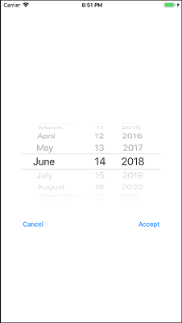
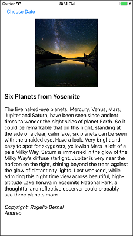

# APOD test
## WSU Vancouver - CS458 - Project 3
### iOS/Swift Project
### Screenshots

### Abstract
[Astronomy Picture of the Day (APOD)](https://en.wikipedia.org/wiki/Astronomy_Picture_of_the_Day) is a website provided by NASA and Michigan Technological University (MTU) where the pictures and descriptions often relate to current events in astronomy and space exploration containing text, visible images and copyright information, if not Public Domain.
More information is in the **/docs** [pdf.](docs/apod.pdf)

If using this for your own application, replace apiKey with your own vs. using the default **DEMO_KEY.**  Apply for your own [API key](https://api.nasa.gov/index.html#apply-for-an-api-key) or get more [information](https://api.nasa.gov/api.html#authentication) about NASA API key.
### Testbed
Built and simulated on a *MacOS Sierra 10.12.6*, *XCode 9.2 (9C40b)* compiler and tested on *Simulator v10.0*.
### TODO
 - When starting, the orientation doesn't change to current orientation
 - Doesn't handle video streams, only images

### Note
All code licenced MIT with exception to the docs/ folder.
